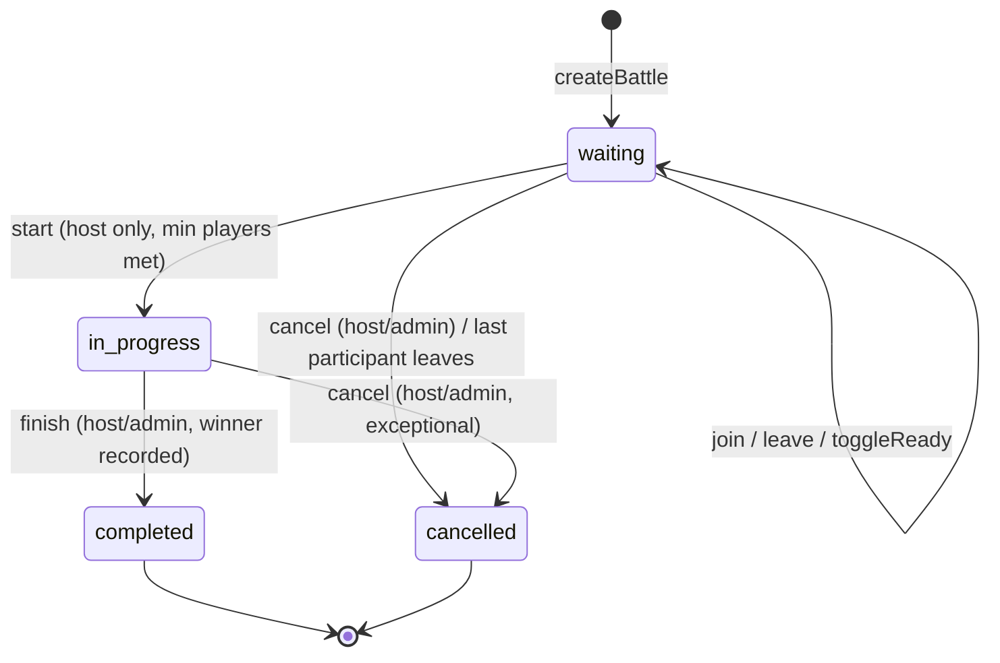

# DOMAIN — Battling Gaming Zone

> Ubiquitous language for engineers, designers, and organizers. Code identifiers
> (`PascalCase` models, `snake_case` enums) mirror these terms exactly.

## 1. Core entities

| Term | Definition | Code |
|---|---|---|
| **Operator** | A registered player account. Has stats, credits, rank, theme. | `User` |
| **Battle** | A single contest instance with lifecycle, participants, events log. | `Battle` |
| **Host** | Operator that created the battle; owns start/cancel rights. | `battle.host` |
| **Challenger** | The joining opponent in a 1v1. | `battle.challenger` |
| **Participant** | Any operator in `battle.participants[]` (host included). | subdocument |
| **Map zone** | Named play area `{ name, coordinates[lng,lat], googlePlaceId }`. | `battle.mapZone` |
| **Prize pool** | Credits at stake; derived from `entryFee × participants` (roadmap: escrow). | `battle.prizePool` |
| **Event log** | Append-only `battle.events[]` — created/joined/left/started/finished. Audit + realtime feed. | subdocument |

## 2. Battle taxonomy

| Type (`battle.type`) | Capacity | Frontend mode mapping | Notes |
|---|---|---|---|
| `one_to_one` | exactly 2 | SOLO_PROTOCOL (1v1 duel) | challenger slot auto-filled on 2nd join |
| `one_to_many` | 3–16 | SQUAD_ASSAULT (4v4) / VOID_ROYALE (up to 16) | `maxParticipants` chosen at creation |

| Mode (`battle.mode`) | Meaning |
|---|---|
| `casual` | No rank impact (default) |
| `ranked` | XP/rank impact; finish awards 150 XP winner / 30 XP loser |
| `tournament` | Organizer-run bracket entry (roadmap: Tournament entity) |

## 3. Battle lifecycle (state machine)

**Guards (all server-side, never trust client):**
- `canJoin()` → `waiting` + not full + not already in.
- Private battles require matching `password` (never returned in reads; `select:false`).
- `start` requires `waiting` + 1v1≥2 / 1vN≥3 players.
- `finish` requires `in_progress`; winner must be a participant (or auto-pick top score).
- `finish` is the **only** transition that mutates economy (XP/credits) — exactly once
  (idempotency key recommended; double-POST replays stored response).

## 4. Economy & progression

| Action | Winner | Others |
|---|---|---|
| Finish ranked/casual battle | +150 XP, +500 credits, `battlesWon+1` | +30 XP, +50 credits, `battlesLost+1` |
| Level/rank | derived from XP (roadmap: thresholds table) | — |
| Entry fee | deducted at join (roadmap — **not yet implemented**, `entryFee` stored only) | — |

> ⚠️ Current gap (tracked): `entryFee`/`prizePool` are recorded but no credit
> escrow runs. Do not advertise prize payouts until escrow + Tournament entity ship.

## 5. Roles & permissions (RBAC)

| Role | Level | Capabilities |
|---|---|---|
| `user` | 1 | register, play, create/join battles, own profile/theme |
| `moderator` | 2 | + list users, ban/unban |
| `organizer` | 3 | + (roadmap) tournament CRUD |
| `admin` | 4 | + change roles, delete users, manage themes, admin stats, finish any battle |

Self-registration is always `user`. Elevation requires an `admin` via `PATCH /users/:id/role`.

## 6. Theme domain

Operators pick one `Theme` (`themeKey` fast path + `selectedTheme` ref + `settings.theme`
mirror). Themes are public-read, admin-write. 10 seeded defaults; user settings
(sound/graphics/notifications/privacy) live on `User.settings`.

## 7. Non-goals / roadmap

- Matchmaking queue (ELO) — structure ready, Socket.io rooms exist.
- Tournament brackets, ELO rating, prize escrow, Google OAuth (`googleId` reserved).
- WebGL post-processing (bloom/glitch) — visual only, no domain impact.
